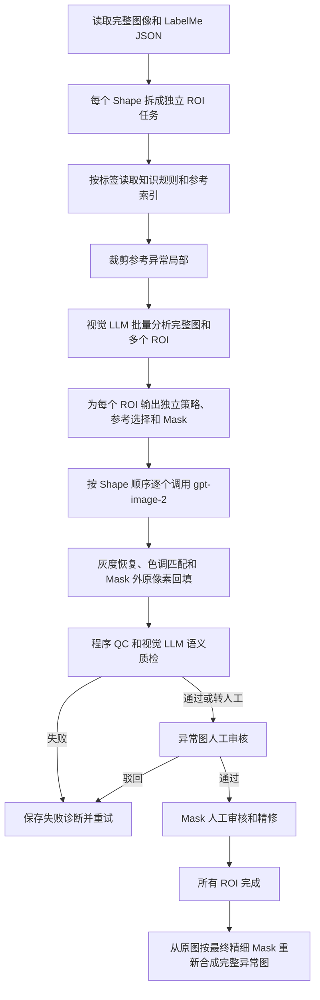

# V2 半自动工业异常生成系统：完整生成流程分析

> 项目路径：`D:\MINE\My_Workshop\image-generation`  
> 分析日期：2026-08-11  
> 本文中的“V2”“image-generation”均指当前项目；“CORE”指 `gpt-image-2` 图像编辑模型。

## 一、核心结论

V2 不是简单的“LabelMe 框 + 固定 Prompt → 生图”流程，而是由四个层次共同控制：

1. **知识库**固定异常语义、物理规律、禁用形态和质量标准。
2. **外层程序**解析 LabelMe、按标签检索参考图、生成和约束 Mask、管理多 ROI、审核、重试及导出。
3. **视觉 LLM**查看完整设备图、ROI 定位图和参考候选，自主进行实例分析、参考选择、Mask 规划、执行策略和语义质检。
4. **CORE（gpt-image-2）**接收完整基础图、独立编辑 Mask、最多两张选中的异常参考图和精简执行 Prompt，完成实际像素编辑。

异常参考图确实会作为图片交给 CORE，不只是把规律写进 Markdown。参考使用方式属于混合机制：

> 程序按标签初筛参考候选 → 视觉 LLM根据当前机械结构选择 → 程序将选中的参考与完整待编辑图一起提交给 CORE。

## 二、总体流程



## 三、LabelMe 和多 ROI 的拆分

程序扫描数据集中的 LabelMe JSON，读取：

- 完整图像路径、宽度和高度；
- 每个 shape 的标签、类型和坐标；
- JSON 声明尺寸与真实图片尺寸是否一致；
- 标签是否已被知识库支持。

当前配置为 `multi_label_mode=per_image_layered`。一张图中即使有多个标记，也会先把每个 shape 展开成独立生成任务。每个 ROI 因而拥有独立的：

- 标签和 Prompt；
- 参考选择；
- 可编辑 Mask；
- 生成次数和失败诊断；
- 异常审核意见；
- 最终精细 Mask。

但是这些 ROI 仍通过原始 JSON 路径归属于同一张完整图片，最终会再次按层合成为一张输出图。

相关代码：

- `anomaly_factory/labelme.py`：`discover_samples()`、`expand_per_shape()`；
- `anomaly_factory/pipeline.py`：`scan()`。

## 四、知识库、程序和视觉 LLM 的职责边界

### 4.1 知识库固定的内容

知识库主要包含：

- `labels.json`：标签、中文名称、异常对象、操作类型、必须满足的规则和禁止项；
- `feedback_rules.json`：审核原因到重生成要求的映射；
- `01_global_rules.md`：全局反事实一致性和图像保持规则；
- `03_missing.md`：零部件丢失规则；
- `04_oil_leak.md`：漏油规则；
- `05_loose.md`：松动规则；
- `06_foreign_objects.md`：异物规则；
- `07_reverse_installation.md`：反装规则；
- `08_prompt_protocol.md`：Prompt 协议；
- `09_quality_gate.md`：质量门槛；
- `reference_index.json`：标签到真实参考图、参考 JSON 和异常 shape 的索引。

Markdown 文件不会以文件附件形式上传。程序只读取当前标签相关的章节，并将文本编译进规划 Prompt。

### 4.2 程序固定执行的内容

程序负责：

- 把标签别名转换成规范标签；
- 仅从相同标签的参考列表中取候选；
- 根据参考 JSON 的异常坐标裁剪参考局部；
- 控制视觉 LLM最多可看的参考候选数；
- 验证 LLM返回的参考下标、Mask 坐标和保护区；
- 控制最终提交给 CORE 的参考图数量；
- 在 CORE 返回后强制回填 Mask 外原像素；
- 计算自动精细 Mask、QC、重试和最终合成。

### 4.3 视觉 LLM自主决定的内容

视觉 LLM只能在程序提供的候选范围内做决定，但会自主分析：

- 完整机械场景、目标零件身份和相邻结构；
- 遮挡、连接、光照和重力方向；
- 漏油源点与连续流动路径；
- 异物的夹持、搭挂或黏附锚点；
- 删除零件后应露出的背景、安装面、孔洞和阴影；
- 哪些参考图与当前场景更匹配；
- 编辑区域应扩大还是收紧；
- 哪些相邻结构需要作为 protected regions；
- 下一轮应换参考、改 Mask、简化编辑还是重新分析结构。

因此参考图并非完全写死，也不是 LLM自由搜索整个参考库，而是“程序检索 + LLM视觉选择”。

## 五、异常参考图的真实使用方式

### 5.1 参考索引

`reference_index.json` 由 `Anomaly-reference` 中的 LabelMe JSON 建立，保存参考图、标签、参考 JSON、异常 shape 和配对正常图信息。

当前生成检索实际使用的是同标签故障图。索引虽然保存 `matching_normals`，但当前 `reference_examples()` 没有把配对正常参考交给规划 LLM或 CORE。

### 5.2 参考图裁剪

程序不会直接把未定位的完整参考图作为主要参考。它根据参考 JSON 中同标签 shape 的坐标：

- 以异常 shape 为中心裁剪；
- 至少保留约 64 像素上下文；
- 或按异常尺寸约 0.65 倍向外扩展；
- 使异常本体位于裁图中心附近；
- 避免 LLM和 CORE学习参考设备中无关的深色零件或背景。

若参考来自历史人工通过的生成结果而没有参考 shape，则可能保留整图，并在 Prompt 中明确只作辅助。

### 5.3 候选数量和 CORE 参考数量

当前队列使用批量规划时，每个 ROI 通常给视觉 LLM最多 2 张参考候选：

```json
"batch_reference_candidate_count": 2
```

单独直接调用单 ROI规划时，最多可给视觉 LLM 3 张候选：

```json
"reference_candidate_count": 3
```

最终给 CORE 的参考图最多 2 张：

```json
"generation.reference_count": 2
```

视觉 LLM通过 `selected_reference_indices` 选择参考。程序会检查下标合法性并最多取前两张。如果 LLM未选择任何候选，程序保留本轮默认的轮换参考，而不是自动变成零参考。重试时参考顺序会轮换。

## 六、视觉 LLM 规划请求

### 6.1 批量规划

同一源图最多每 4 个 ROI组成一批：

```json
"batch_planner": true,
"batch_planner_max_rois": 4
```

一张图有 3 个 ROI 时，通常一次视觉 LLM请求完成整图理解，再分别返回三个 ROI 的独立计划。

视觉 LLM收到的图片大致为：

1. 完整待编辑源图；
2. ROI 1 定位视图；
3. ROI 2 定位视图；
4. ROI 3 定位视图；
5. ROI 1 参考候选；
6. ROI 1 第二张参考候选；
7. ROI 2 参考候选；
8. 其他 ROI 的参考候选；
9. 如存在失败历史，最后加入失败候选联系表作为负例。

定位视图是完整图的辅助副本：绿色边界表示 LabelMe 语义重点，橙色边界表示初始可编辑上下文，橙色外被压暗。彩色线只供规划 LLM定位，不会作为 CORE 的待编辑源图。

### 6.2 请求格式

视觉 LLM通过 `/v1/responses` 接收一个 JSON 请求。内容包括：

```text
input_text  = 知识规则、LabelMe 信息、审核反馈、参考编号和规划要求
input_image = 完整源图（data URL，detail=high）
input_image = ROI 定位视图
input_image = 参考候选图……
input_image = 失败候选联系表（可选）
```

输出由严格 JSON Schema 限制，主要字段包括：

- `scene_analysis`；
- `physical_anchor`；
- `selected_reference_indices`；
- `reference_rationale`；
- `edit_instruction`；
- `edit_context_scale`；
- `mask_geometry`；
- `mask_regions`；
- `protected_regions`；
- `must_preserve`；
- `negative_patterns_to_avoid`；
- `background_preservation_plan`；
- `candidate_directives`；
- `retry_action`。

## 七、LabelMe 信息究竟交给了谁

### 7.1 给视觉 LLM

规划 Prompt 中包含紧凑化 LabelMe JSON。当前活动 shape 被标记为：

```text
ACTIVE_TARGET
```

同图其他 shape 被保留并标记为：

```text
CONTEXT_ONLY_DO_NOT_EDIT
```

所以视觉 LLM能看到完整标注关系，而不是只知道当前框。

### 7.2 给 CORE

系统会在中间产物中保存 `labelme_for_core.json`，但当前智能代理路径不会把该 JSON 文件直接上传给 `gpt-image-2`。

最终 CORE Prompt 包含：

- 当前活动 shape 的索引、标签、类型和坐标；
- 标签执行规则；
- 视觉 LLM提炼出的场景分析和物理锚点；
- 编辑指令；
- Mask 元数据；
- 必须保留和禁止事项；
- 审核意见。

它没有再次包含完整的其他 shape 紧凑 JSON。因此 `labelme_for_core.json` 当前主要是审计产物，完整 LabelMe 信息主要在上游被视觉 LLM使用，再通过提炼计划间接影响 CORE。

代码中的 `delivery=serialized_verbatim_as_compact_JSON_inside_prompt` 与当前智能代理 CORE 路径存在轻微描述偏差。这是后续若要进一步加强 CORE全局标注感知时应优先修正的地方。

## 八、CORE 的真实 POST 内容

CORE调用：

```text
POST {base_url}/v1/images/edits
Content-Type: multipart/form-data
```

普通字段：

```text
model=gpt-image-2
prompt=视觉 LLM计划压缩后的 CORE 执行 Prompt
quality=当前 config.json 中的质量设置
output_format=png
n=当前候选数量
size=API 支持时使用规范化后的源图尺寸
```

文件字段：

```text
image[]=source.png
mask=mask.png
image[]=reference_01.png
image[]=reference_02.png
```

结论：

- 完整待编辑图和参考异常图在同一次 POST 中提交；
- 完整待编辑图始终是第一张 `image[]`；
- 参考图作为后续 `image[]`；
- Mask 使用独立的 `mask` 字段；
- Prompt 明确声明 Image 1 是可编辑基础图，Image 2、Image 3 是异常参考；
- CORE收到完整图，不是 ROI 裁图；
- 源图和 Mask可能按相同比例规范化到 API 支持尺寸；
- 参考图的 LabelMe JSON不会上传，程序只用它定位并裁剪参考异常。

### 输入对应关系

| 内容 | 视觉 LLM | CORE |
|---|---|---|
| 完整源图 | 独立 input_image | `image[]=source.png` |
| LabelMe 彩色定位视图 | 独立 input_image | 不发送 |
| 原始 LabelMe focus mask | 通过定位视图体现 | 不单独发送 |
| 扩展/代理规划编辑 Mask | 通过定位视图和文字体现 | `mask=mask.png` |
| 完整 LabelMe JSON | 紧凑 JSON 文本 | 不上传原文件，当前也不含完整 JSON |
| 选中的异常参考图 | 独立 input_image | 后续 `image[]`，最多两张 |
| 参考图 LabelMe JSON | 不直接发送 | 不发送，仅用于裁图 |

## 九、Mask 的生成和约束

系统区分两种区域：

1. `labelme_focus_mask.png`：原始语义重点，不是异常轮廓，也不是硬边界；
2. `core_edit_context_mask.png`：CORE最大允许编辑区域，可大于 LabelMe shape。

默认上下文至少扩展 96 像素，或按 ROI跨度约 35% 扩展。视觉 LLM还可输出：

- `mask_regions`：真实允许编辑的多个局部岛；
- `protected_regions`：必须从编辑范围中扣除的孔洞、边缘、轴、邻近零件和高光区域。

程序会把 LLM返回的像素坐标栅格化，并执行：

- 坐标限制在图片内部；
- 与默认上下文 Mask取交集；
- 扣除 protected regions；
- 检查是否与原始 focus 相交；
- 检查最小有效面积；
- 无效时退回默认扩展 Mask。

CORE的 Mask 会转换为 Image Edits 所需的 alpha 语义：流水线内部白色表示可编辑，提交时转换成透明像素表示可编辑。

## 十、CORE 返回后的强制保真处理

CORE返回完整图后，程序执行：

1. 检查并恢复原尺寸；
2. 如果原图是灰度视觉，强制输出转换为灰度；
3. 对编辑区执行局部色调匹配；
4. 收缩 Mask 边缘形成安全带；
5. 对 Mask边缘轻微羽化；
6. 使用 `Image.composite(generated, source, blend_mask)` 合成。

因此 Mask 外直接回填本轮基础图原像素。即使 CORE重画了 Mask 外背景，也不会进入正式候选。

随后程序在允许区域内计算本轮基础图与候选图的像素差，生成自动精细 Mask：

```text
mask_draft.png
```

## 十一、自动 QC 和视觉语义质检

程序 QC首先检查：

- 是否几乎没有变化；
- 修改面积是否过大；
- 是否触碰图片边缘；
- 输出尺寸是否错误；
- 编辑边界是否存在灰度接缝；
- 区域内外亮度是否突变。

程序 QC通过后，视觉 LLM质检收到：

1. 本轮实际基础图；
2. 生成候选图；
3. ROI 定位视图；
4. 当前配置下最多 1 张本轮参考异常图；
5. 本轮规划 JSON 的文字内容。

视觉质检判断：

- 标签语义是否正确；
- 异常是否足够明显；
- 机械结构、材料、重力、接触和遮挡是否合理；
- 目标是否完整增加、移除或改变；
- 是否存在矩形贴片、灰度接缝、背景重绘和无依据结构；
- 去掉异常后能否恢复本轮基础图。

失败时返回 `reason_codes`、`diagnosis` 和 `revision_instruction`，供后续自动重试和人工审核使用。

## 十二、多 ROI 的顺序生成和最终集成

当前配置：

```json
"multi_roi_source_mode": "sequential_success"
```

假设一张图有 A、B、C 三个 ROI：

1. A 基于原图生成；
2. A 自动 QC通过后，程序从原图临时合成 A，作为 B 的完整基础图；
3. B 自动 QC通过后，从原图临时合成 A+B，作为 C 的完整基础图；
4. Prompt 要求 CORE锁定已经存在的前序 ROI异常，不得修复或覆盖。

这不代表原始图片被逐步覆盖。每个后续基础图都是程序临时重建的 `agent_sequential_source.png`。

全部 ROI完成异常审核和 Mask审核后，最终导出再次从原始图开始，按 shape 顺序执行：

```python
combined = original
combined = Image.composite(roi_a_candidate, combined, roi_a_final_mask)
combined = Image.composite(roi_b_candidate, combined, roi_b_final_mask)
combined = Image.composite(roi_c_candidate, combined, roi_c_final_mask)
```

各 ROI Mask通过 `ImageChops.lighter` 合并为最终 union mask。

因此准确表述是：

> 每个自动质检成功的 ROI会进入后续 ROI的生成上下文；原图不会被覆盖。全部人工审核完成后，系统从原图使用各 ROI最终精细 Mask重新合成一次完整异常图。

## 十三、失败、重试和人工审核

### 13.1 传输失败

CORE的 HTTP 408、429、5xx、超时和网络中断属于传输失败。适配器内部重试后，任务层还可重新提交。传输失败与内容质量失败分开记录。

### 13.2 内容失败

内容失败可能来自程序 QC或视觉 LLM语义质检。系统会保存：

- 失败代码；
- 视觉诊断；
- 下一轮修正指令；
- 失败候选联系表；
- 最近失败轮次记忆；
- 上一轮参考和 Mask策略。

下一轮需要改变参考、Mask或实例策略，避免重复完全相同的失败方式。

异常图通过人工审核后进入 Mask审核；Mask可在网页中添加、擦除、撤销、重做和保存。只有同图所有 ROI均完成两个审核阶段，整张图片才具备正式导出条件。

## 十四、并行规划

`parallel_planning=true` 时，当前 ROI进行 CORE生成或视觉质检的同时，程序可使用独立视觉 LLM客户端预先规划下一张图片。

为了保护 `sequential_success` 依赖，同一张图片中依赖当前输出的后续批次不会被提前错误规划。并行主要发生在不同图片之间：

```text
图片 A：CORE生成 / 语义质检
图片 B：视觉 LLM预规划
```

## 十五、中间产物与审计

每个逻辑轮次会保存关键中间文件，例如：

- `intelligence_plan.json`：单 ROI规划；
- `intelligence_batch_plan.json`：同图多 ROI批量规划；
- `labelme_focus_mask.png`；
- `core_edit_context_mask.png`；
- `agent_semantic_mask.png`；
- `labelme_for_core.json`；
- `prompt.txt`；
- `core_raw.png`；
- `candidate.png`；
- `mask_draft.png`；
- `qc.json`；
- `input_manifest.json`：输入文件大小、SHA-256、图片顺序、参考来源和最终选择；
- `job.json`：本轮任务总记录。

这些文件用于：

- 检查实际给模型的源图、参考、Mask和 Prompt；
- 复现失败；
- 根据审核意见重生成；
- 判断多 ROI依赖；
- 追踪模型、质量设置和调用结果。

## 十六、当前实现的重要限制

1. 参考索引中保存了异常/正常配对信息，但当前生成只使用异常参考图。
2. 参考检索目前以标签过滤为主，没有图像向量相似度检索；LLM只能在程序提供的少量候选中选择。
3. 完整 LabelMe JSON用于视觉 LLM规划，但没有作为原文件或完整文本直接传给 CORE。
4. `labelme_for_core.json` 中的 delivery 描述与智能代理最终 CORE Prompt存在轻微实现偏差。
5. 后序 ROI可使用前序自动 QC通过但尚未人工批准的异常作为上下文；最终导出仍会使用各 ROI最终批准的候选和 Mask重新合成。
6. 如果不同 ROI的最终 Mask重叠，后合成的 ROI图层会覆盖重叠部分，因而 shape 顺序具有意义。

## 十七、当前调用数量的估算

若一张图片包含 N 个 ROI，且没有重试，当前流程大致需要：

- `ceil(N / 4)` 次视觉 LLM批量规划请求；
- N 次 CORE图像编辑请求；
- N 次视觉 LLM语义质检请求；
- N 次异常图人工审核；
- N 次 Mask审核；
- 1 次本地最终图层合成。

若配置为每轮多候选，则 CORE和单候选语义质检次数会相应增加；若开启比较质检，还会额外增加候选横向比较 LLM请求。

## 十八、一句话架构定义

> V2 是一个以 LabelMe 为任务入口、以知识库和真实异常参考为依据、由视觉 LLM管理实例分析、参考选择、Mask与重试策略、由 gpt-image-2执行完整图局部编辑、再由程序强制完成灰度保真、Mask外回填、多 ROI合成和双阶段人工审核的半自动工业异常数据生成系统。
